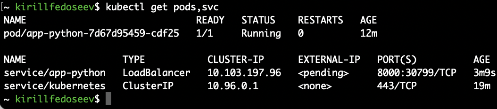
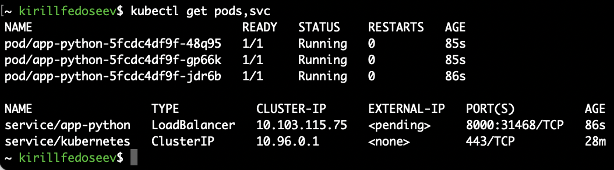
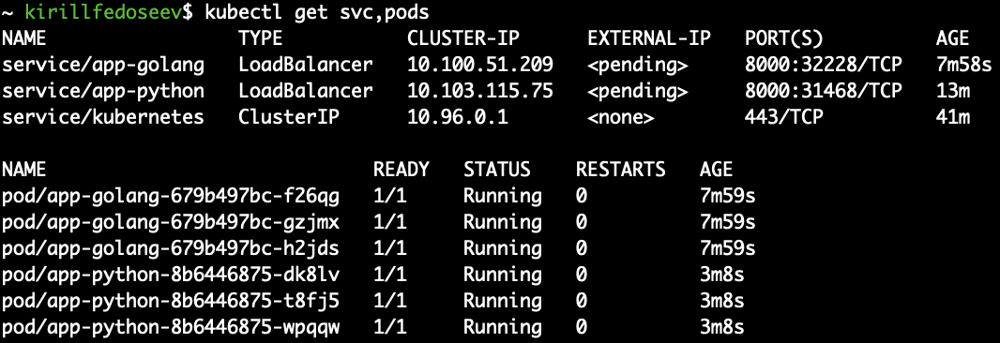

# K8s deployment

## Creating deployment and service using plain CLI commands

```bash
kubectl create deployment app-python --image=ghcr.io/k1rill-fedoseev/devops:master
kubectl expose deployment app-python --type=LoadBalancer --port=8000
minikube service app-python
```



## Creating deployment and service using yaml configs

```bash
kubectl apply -R -f ./k8s/app-python
minikube service app-python
```



## Deploy 2 applications

```bash
kubectl apply -R -f ./k8s
minikube service app-golang
```


