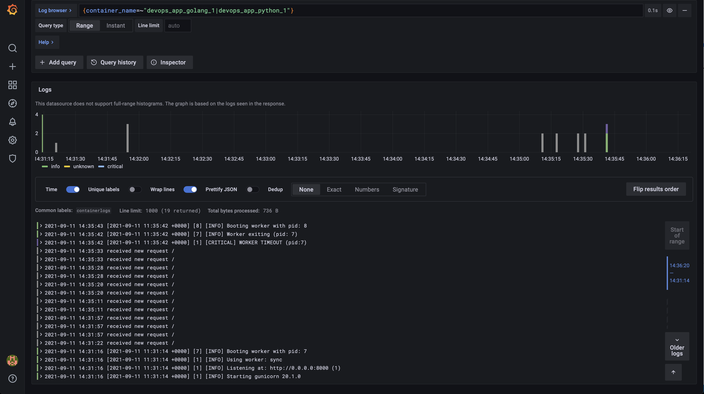

# Logging

## Success screenshot

Logs are collected from all docker containers on the system,
including monitoring stack itself + 2 containers with applications.

## Best practices

- Save Grafana state to docker volume, if running inside docker.
- Create meaningful tags in promtail.
- Ensure that log levels are correctly parsed.
- Avoid creating tons of logs in the applications, since their storage is not free.
- Configure log size limits and log file rotation.
- Ensure that you have enough disk space for storing max theoretical amount of logs.
